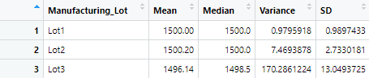

# MechaCar_Statistical_Analysis
Analysis of multiple datasets using R

## Linear Regression to Predict MPG
Below is the output of running linear regression on the MechaCar_mpg.csv dataset. Using this information we can answer the following questions.
- **Which variables/coefficients provided a non-random amount of variance to the mpg values in the dataset?**
    - vehicle_length and ground_clearance are both of the non-random variances.
- **Is the slope of the linear model considered to be zero? Why or why not?**
    - No, since the multiple R-squared value is 0.7149.
- **Does this linear model predict mpg of MechaCar prototypes effectively? Why or why not?**
    - Yes, because the model has an okay p-value of 5.35e-11.

## Summary Statistics on Suspension Coils
- **The design specifications for the MechaCar suspension coils dictate that the variance of the suspension coils must not exceed 100 pounds per square inch. Does the current manufacturing data meet this design specification for all manufacturing lots in total and each lot individually? Why or why not?**
    - Lots 1 & 2 seem to meet the current design specification as their variance combined with standard deviations keeps the resulting number well below 100, however lot 3 does not meet this standard. In total, even with Lot 3 being under the desired quality the overall total also stays below 100.

