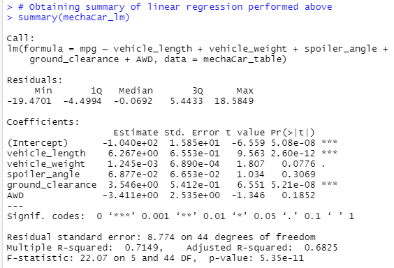

# MechaCar_Statistical_Analysis
Analysis of multiple datasets using R

## Linear Regression to Predict MPG
Below is the output of running linear regression on the MechaCar_mpg.csv dataset. Using this information we can answer the following questions.
- **Which variables/coefficients provided a non-random amount of variance to the mpg values in the dataset?**
    - vehicle_length and ground_clearance are both of the non-random variances.
- **Is the slope of the linear model considered to be zero? Why or why not?**
    - No, since the multiple R-squared value is 0.7149.
- **Does this linear model predict mpg of MechaCar prototypes effectively? Why or why not?**
    - Yes, because the model has an okay p-value of 5.35e-11.

